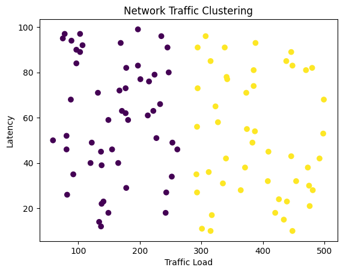
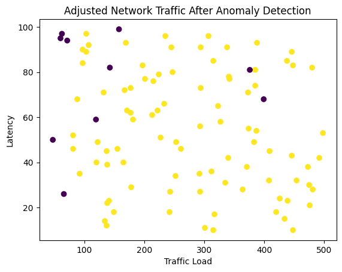

## Self-Optimizing Networks (SON) 5G Project 

## 📑 Table of Contents

- [Group Details](#group-details)
- [Mentor](#mentor)
- [Video Presentation](#video-presentation)
- [Project Overview](#project-overview)
- [Problem Statement](#problem-statement)
- [Features](#features)
- [Technologies Used](#technologies-used)
- [Installation](#installation)
- [Usage](#usage)
- [Project Workflow](#project-workflow)
- [Example Outputs](#example-outputs)
- [Future Scope](#future-scope)
- [Contributing](#contributing)
- [Acknowledgements](#acknowledgements)
- [Screenshots](#screenshots)

---

## Group Details 
**Group Number:** Gr47EC431  
**Group Members:**
- **Falanshu Mangal** (202111027)
- **Himanshu Gupta** (202111038)
- **Jayesh Chak** (202111040)
- **Raman Sharma** (202111069)


---

## Mentor
- **Dr. Bhupendra Kumar**

---

## Video Presentation
[https://drive.google.com/file/d/16FHd9Gl-wiIx-YjeTItOy8adNHHdUITO/view?usp=sharing](https://drive.google.com/drive/folders/18jmKIWOcqjGxcd5mIAFdbZB_9M0D_RXf)

---

## Project Overview

This project demonstrates a **Self-Optimizing Network (SON)** implementation for 5G using **Machine Learning (ML)**. It showcases how clustering algorithms can detect bottlenecks, and anomaly detection models can identify unusual network behaviors, enabling dynamic optimization of network parameters.

---

## Problem Statement

Managing 5G networks manually is complex and time-consuming. With increasing traffic and dynamic network conditions, maintaining optimal performance requires automation. This project addresses these challenges by:

* Identifying network bottlenecks.
* Detecting anomalies in network behavior.
* Simulating dynamic parameter adjustments to enhance performance.

---

## Features

* **Data Simulation**: Generate synthetic 5G network data, including traffic load, signal strength, bandwidth usage, and latency.
* **Clustering (K-Means)**: Classify network sectors as "normal" or "overloaded."
* **Anomaly Detection (Isolation Forest)**: Identify sectors exhibiting unusual behaviors like traffic spikes or low signal strength.
* **Dynamic Optimization**: Simulate adjustments to network parameters to resolve bottlenecks and anomalies.
* **Visualizations**: Scatter plots showing network status before and after optimization.

---

## Technologies Used

* **Python**
  - Libraries: `numpy`, `pandas`, `matplotlib`, `scikit-learn`
* **Machine Learning**
  - Clustering: K-Means
  - Anomaly Detection: Isolation Forest

---

## Installation

```bash
# Clone the repository
git clone https://github.com/IIITV-5G-and-Edge-Computing-Activity/Self-Optimization-Network-5G.git

# Navigate to the project directory
cd Self-Optimization-Network-5G

# Install the required dependencies
pip install -r requirements.txt
```

## Usage

Open the project in Google Colab or any Python IDE.
Run the provided Python scripts step-by-step:

1. Simulate network data.
2. Apply clustering (K-Means) for bottleneck detection.
3. Use Isolation Forest for anomaly detection.
4. Adjust network parameters dynamically.
5. Visualize the results using scatter plots.

## Project Workflow

1. **Data Simulation:** Generate 100 synthetic records of network metrics.
2. **Bottleneck Detection:** Apply K-Means Clustering to classify network performance.
    * Visualize clusters (e.g., normal vs. overloaded).
3. **Anomaly Detection:** Detect unusual behaviors using Isolation Forest.
    * Mark sectors with anomalies for further optimization.
4. **Dynamic Optimization:**
    * Reduce traffic load in overloaded sectors.
    * Improve signal strength in low-quality areas.
5. **Visualization:** Scatter plots comparing network performance before and after optimization.

## Example Outputs

**## Bottleneck Detection**

Scatter plot showing traffic load vs. latency:

* Cluster 0: Normal sectors.
* Cluster 1: Overloaded sectors.

**## Anomaly Detection**

Scatter plot with flagged anomalies:

* -1: Anomaly detected.
* 1: Normal.

**## Optimization Results**

Visualization of adjusted parameters:

* Traffic load reduced by 20%.
* Signal strength improved by 10 dB.

## Future Scope

* Integration with real-world 5G network data.
* Advanced ML models (e.g., reinforcement learning) for optimization.
* Support for multi-cell networks and dynamic routing.

## Contributing

Fork this repository and create a feature branch before making any changes. 

## Acknowledgements

* 5G concepts and implementation inspired by academic resources.
* Machine learning algorithms implemented using scikit-learn.
* Visualization powered by matplotlib and pandas.

## Screenshots
* Before_Optimization.png (Traffic load vs. latency with clusters shown)
* 
* After_Optimization.png (Adjusted metrics after dynamic optimization)
* 
